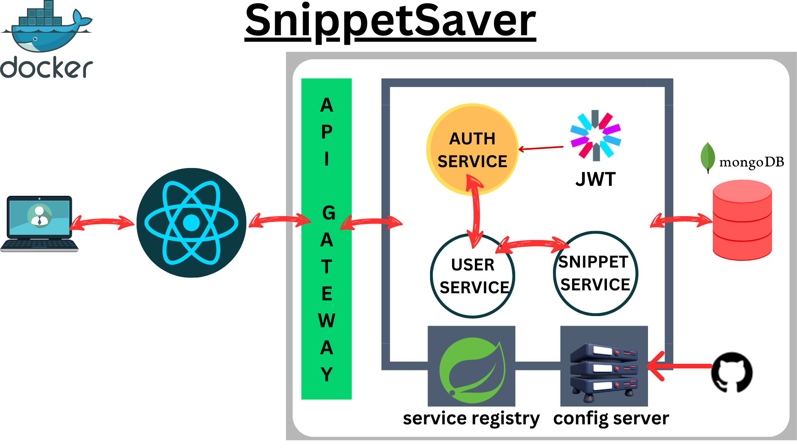
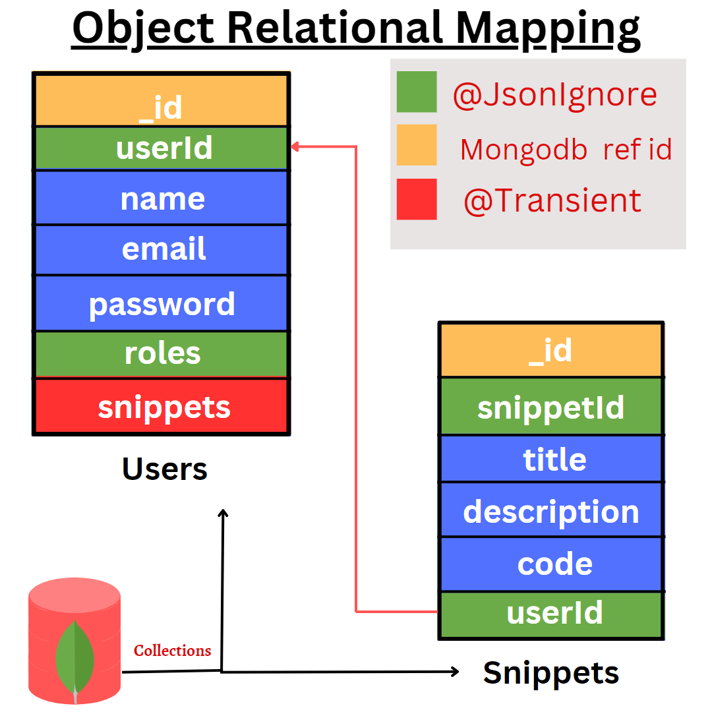

# Snippet Saver

* This is a full stack web development project. The purpose of the website is that developers from across the world can access the code snippets which assist during coding and building projects. This project follows microservice architecture. The backend part will be designed with springboot, and the frontend part will be designed with React + Typescript.
* The brief description of the project is it will be a social media of code snippets. Where many users can create their snippets, check out, others copy them and assist self-coding.
* If the above idea goes well, then I will implement a likes and comment system. I have a planning to integrate a chat system with these. Though this project will be a microservice, it is easy to add more and more service.

> Documentation [Postman](https://documenter.getpostman.com/view/23395461/2s93m7X1zz)
## Contact me 
[](https://www.facebook.com/abhisek.mohanty.79069/)
[](https://www.linkedin.com/in/abhisek-mohanty-3a2241235/)
[](https://github.com/abhisekmohantychinua)

### **SnippetSaver Architecture**


* Above is the current architecture of the project which is upgraded.
* These are the previous architectures :
    1. [snippetsaver-architecture-1](./snippetsaver-architecture.png)

### **ORM for Entities**

#### Problem solved by the above ORM
> While I am trying to Fetch all snippets by userId and Fetch the user by snippetId, it creates a recursion between the json responses. To solve this issue, I have added a field `userId` in `Snippet` which may take an unnecessary space, but it is far better than storing the reference of `Snippet` entity in `User`.It does the both above things with ```Optionl<Snippet> findById(String snippetId)``` and ```List<Snippet> findAllByUserId(String userId)```.

### MongoDB's connectivity with .env file
I have configured mongodb connectivity using only `spring.data.mongodb.uri`
and `spring.data.mongodb.database` which gives me `org.springframework.data.mongodb.UncategorizedMongoDbException: Exception authenticating MongoCredential{mechanism=SCRAM-SHA-1, userName='abhis', source='admin', password=<hidden>, mechanismProperties=<hidden>}`.So
to avoid this kind of error, you have to provide username and password explicitly.

```yaml
spring:
  data:
    mongodb:
      uri: ${URL}
      username: ${USERNAME}
      password: ${PASSWORD}
      database: ${DATABASE}
```
Password and Other credentials shouldn't be public, so I have created an `.env` file
and stored my data in a key value pair and added file name to [`gitignore`](./user-service/.gitignore).I have also given a reference
as [`.env.example`](./user-service/src/main/resources/.env.examples) check that out.


* **important**: Must add the spring dotenv dependency to you `buil.gradle` or `pom.xml`.
* If the dotenv version is older, then we have to write 
```yaml
    spring:
      data:
          mongodb:
              uri: ${env.URL}
              username: ${env.USERNAME}
              password: ${env.PASSWORD}
              database: ${env.DATABASE}
```
___
```groovy
dependencies {
    implementation 'me.paulschwarz:spring-dotenv:4.0.0'
}
```

> Check out the GitHub repository and documentation of the above extension [spring-dotenv](https://github.com/paulschwarz/spring-dotenv.git)

