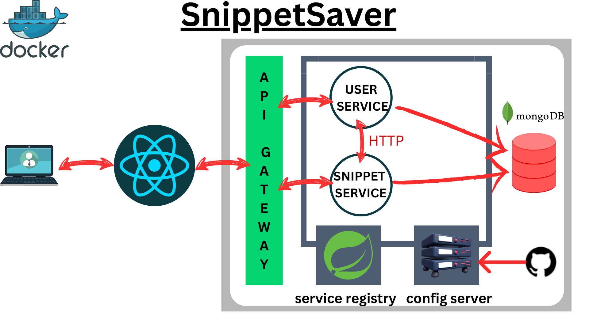

# Snippet Saver

* This is a full stack web development project. The purpose of the website is that developers from across the world can access the code snippets which assist during coding and building projects. This project follows microservice architecture. The backend part will be designed with springboot, and the frontend part will be designed with React + Typescript.
* The brief description of the project is it will be a social media of code snippets. Where many users can create their snippets, check out, others copy them and assist self-coding.
* If the above idea goes well, then I will implement a likes and comment system. I have a planning to integrate a chat system with these. Though this project will be a microservice, it is easy to add more and more service.

## Contact me 

### SnippetSaver Architecture
